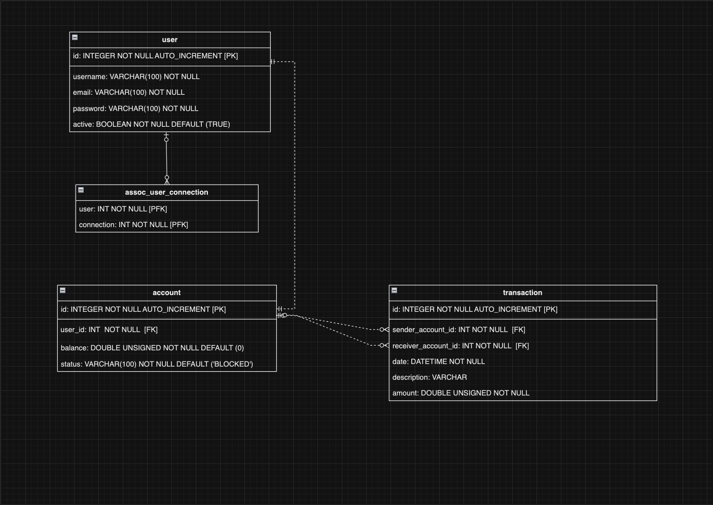

# Pay My Buddy

**Pay My Buddy** is a Java-based application that allows users to send and receive payments between friends or contacts (buddies). It provides a simple platform to manage financial transactions in a secure and intuitive way.

## Table of Contents

- [Features](#features)
- [Installation](#installation)
- [Usage](#usage)
- [Technologies](#technologies)
- [Physical Data Model](#physical-data-model)
- [Contributing](#contributing)
- [License](#license)

## Features

- User authentication and authorization
- Manage contacts and send payments
- Transaction history for each user
- Real-time balance updates

## Installation

### Prerequisites

- Java 21 or higher
- Maven 3.6+
- MySQL Database

### Steps

1. Clone the repository:
    ```bash
    git clone https://github.com/TomPlr/oc-java-projet-6-pay-my-buddy.git
    ```
2. Configure your database settings in `src/main/resources/application.properties`:
    ```properties
    spring.datasource.url=<your-url>
    spring.datasource.username=<your-username>
    spring.datasource.password=<your-password>
   spring.jpa.properties.hibernate.dialect=org.hibernate.dialect.MySQLDialect
    ```
3. Build the project:
    ```bash
    mvn clean install
    ```

4. Run the application:
    ```bash
    mvn spring-boot:run
    ```

## Usage

- Register an account
- Add contacts by their email
- Transfer funds to your buddies and track the history

## Technologies

- **Java 21**
- **Spring Boot** - Backend framework
- **Hibernate** - ORM for database access
- **Thymeleaf** - Templating engine for the UI
- **MySQL** - Relational database

## Physical Data Model



## Contributing

1. Fork the repository
2. Create your feature branch (`git checkout -b feature/AmazingFeature`)
3. Commit your changes (`git commit -m 'Add some AmazingFeature'`)
4. Push to the branch (`git push origin feature/AmazingFeature`)
5. Open a Pull Request

## License

This project is licensed under the MIT License.